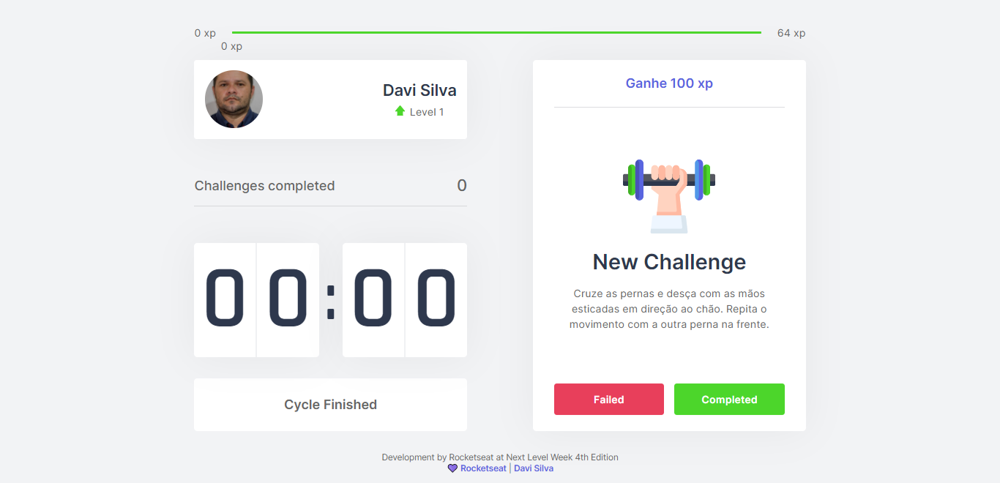

<div align="center" id="top"> 
  

&#xa0;

<a href="https://moviet-ds.vercel.app/">Demo</a>

</div>

<h1 align="center">Move.it</h1>

<br>

## About

Basead in Pomodoro, this is a simple countdown with challenges.

## :rocket: Technologies

The following tools were used in this project:

- [React](https://pt-br.reactjs.org/)
- [NextJS](https://nextjs.org/)
- [TypeScript](https://www.typescriptlang.org/)

## Plus

- Responsive
- Modal completed challenge version 2
- Language English
- Footer

## Starting

```bash
# Clone this project
$ git clone https://github.com/davi1985/moveit-ds

# Access
$ cd moveit-ds

# Install dependencies
$ yarn

# Run the project
$ yarn dev

# The server will initialize in the <http://localhost:3000>
```

## Screenshots

#### Home

<div align="center" id="top"> 
  

#### Challenge Completed

<div align="center" id="top"> 
  

#### Modal

<div align="center" id="top">


#### Mobile

<div align="center" id="top"> 
  

Development by Rocketseat at Next Level Week 4th Edition <br />
<a href="https://rocketseat.com.br/" target="_blank">
<strong>💜 Rocketseat</strong>
</a> | <a href="https://github.com/davi1985" target="_blank">
<strong>Davi Silva</strong>
</a>
&#xa0;

<a href="#top">Back to top</a>
